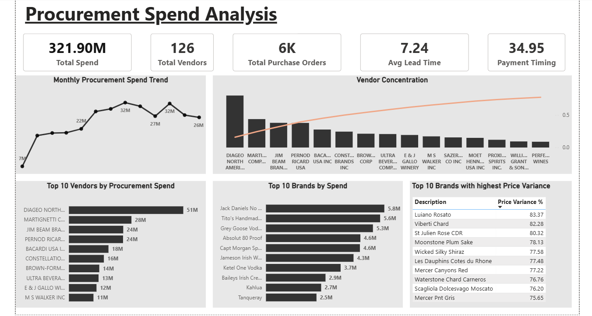

# Procurement Spend Analysis
# Project Overview
This project analyzes procurement spending using SQL Server and Power BI. 
It transforms raw procurement data into interactive visualizations that help monitor spending patterns, supplier performance, procurement efficiency, and pricing trends.
-------------------------------
# Tools & Technologies
- Microsoft Excel
- SQL Server
- Power BI
- DAX
-------------------------------
# Project Workflow
→ Excel Data
→ SQL Server
→ Data Cleaning & Transformation
→ SQL Views
→ Power BI Dashboard
--------------------------------

## Dashboard Preview

----------------------------------
# Dashboard Features
- Total Spend KPI
- Total Vendors
- Total Purchase Orders
- Average Lead Time
- Average Payment Time
- Monthly Spend Trend
- Top 10 Vendors by Spend
- Top 10 Brands by Spend
- Vendor Concentration (Pareto Chart)
- Top 10 Brands with Highest Price Variance
------------------------------------
# Key Business Insights
- Identified overall procurement spending trends.
- Highlighted supplier concentration and top vendors.
- Monitored procurement lead time and payment performance.
- Detected brands with high price variance for cost optimization.

## 👤 Author
**Chaitanya**
